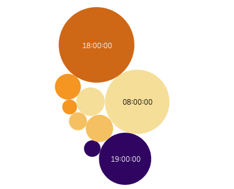

# Filling the Gaps; Bicing Use and How Data Analytics Can Help Institutions Complete Historical Data Records #

## Edward Rodger Martinez - Ironhack Final Project - December 2023 ##

Please feel free to explore the following Tableau link for an interactive version of the data visualisations.

https://public.tableau.com/app/profile/edward.rodger.martinez/viz/FillingtheGapsBicingandDataAnalytics/FillingtheGaps

### Overview ###

This is a Data Analytics project using databases from Open Data Barcelona on the use of Bicing public bicycles in Barcelona. The database contains timestamps at intervals of between 5 and 15 minutes, and for each timestamp provides a number of bicycles in use across Barcelona at that exact time. The timespan covered by the available data is from August to December 2018, in 5 separate databases (one per month). When I contacted the Ajuntament de Barcelona (Barcelona City Council) to ask if more data was available, they referred me to a document stating that no further data was available due to a change of system in 2019. 

The goal of this project is to identify patterns in the use levels of Bicing bicycles, and to train a predictive model to predict levels of bicycle use, in order to help the city council complete its incomplete dataset. 

The project therefore addresses a very common problem in the public sector; public institutions are often under tight budgets and have inconsistent methods for collecting data, often leading to incomplete, patchy datasets. More broadly, therefore, this project explores how predictive modelling can help public institutions fill gaps in their historical data records, helping them get better insights and a more complete picture in order to make better decisions going forward.
 

### Requirements and Libraries ###

Code was written on Jupyter Notebook and Visual Studio Code, some queries and EDA were carried out on SQL, and data visualisations were done on Tableau. Additionally, the Open Meteo API was used to add the weather components to the dataset. The following libraries were used within Python: 

pandas
numpy
datetime
seaborn
matplotlib
statsmodels
sklearn
requests_cache
retry_requests
openmeteo_requests

### Workflow ###

Step 1: Concatenated 5 datasets from Open Data Barcelona, showing number of bikes in use at 5-15 minute time intervals for each month between August and December 2018. The resulting concatenated dataset had approximately 26 000 rows.

Step 2: Did some feature engineering to expand the dataset. With the use of the datetime library; I added a column stating if the datetime value in each row corresponded to a weekday or weekend, another column stating if it was a bank holiday (after manually adding a list of Barcelona bank holidays), another column stating if it was the eve of a weekend or bank holiday (eg. Fridays), and another column categorising the time of day into morning (6-12AM), afternoon (12AM-6PM), evening (6-12PM) and night (12PM-6AM). 

Step 3: Used the Open Meteo API to integrate 2 new columns; one showing the level of precipitation at that timestamp in Barcelona (in mm), and the other showing the temperature (in degrees celsius), to the nearest hour. The API provided historical weather data with time intervals of 1 hour, so it was slightly less exact than the data set I had (time intervals between 5-15 minutes). For exmaple; this meant that for timestamp 18:36:00, the weather information in that row corresponds to the API's information for 18:00:00. 

*Figure 1: Final Dataset*

Step 4: Using this transformed data set, I imported the resulting csv file into Tableau and made the visualisations showing daily and weekly seasonality in Bicing use, as well as how use levels correlate with rainfall and temperature. 

Step 5: I used my transfored data set as a base to make a second dataset for the predictive model. Since I planned on using the predictive model to fill the gap in data from January 2019 to November 2023, I added in columns with hourly timestamps showing the same information as in my previous dataset - time of day, weekend/bank holiday vs weekday, rainfall and temperature. All the same steps were repeated. I then did some feature engineering to turn all the categorical columns into dummies. 

Step 6: I trained different predictive models on the available data. The features were; time of day, weekend/bank holiday or weekday, eve of weekend/bank holiday, temperature and rainfall. The target variable was the number of bikes in use. I used a Random Forest Regressor with an R2 of 0.85 and a RMSE of 89. I added a column to my dataset for 'y pred', representing the model's prediction for number of bikes in use at each given timestamp, side by side with the real data. From January 2019 onwards, there was no real data for the number of bikes in use, only the prediction. 

Step 7: Using this dataset, I put together the visualisations to show the model's accuracy, as well as its use and limitations. 

### Daily and Weekly Seasonality in Bicing Use ###

*Figure 2: Number of Bicing bikes in use over time, August - December 2018, updated every ~15 minutes*

The clearest patterns in the data when looking at number of bikes in use over time is in the daily and weekly seasonality. Unsurprisingly, use levels are higher during the day (up to 1200 bikes in use) and much lower during the night. Additionally, you can clearly see lower use levels overall on weekends and public holidays vs on weekdays. 

*Figure 3: Average number of bikes in use at any given time each day, weekdays vs weekends/public holidays*

Lastly, we can see that during the day, use levels peak twice, once between 8 and 9AM, and once again between 6 and 7PM. These peaks are extremely regular - using SQL queries, I discovered that of the 1000 highest peaks in bicycle use (i.e. 1000 timestamps with the highest number of bikes in use over the 5 months of the database), 78% of them were either between 8-9AM or 6-8PM. 

*Figure 4: Times of day (grouped by hour slot) of 1000 highest peak times for number of bike in use*

Therefore, the data shows us 3 very regular patterns - high use during the day and low use at night; higher use on weekdays than on weekends; and very reliable peaks in use during 'rush hour' - between 8 and 9AM, and 6 and 8PM (especially 6-7PM). While this is not exactly surprising, the reliable concentration of the peaks at rush hour is worth noting.

### Rain and Bicing Use ###

*Figure 5: Number of Bicing bikes in use over time, and precipitation (mm), 26 October - 11 November 2018*

Another clear trend is that, via the open weather API providing us with hourly precipitation rates in mm, we can see that high rainfall often coincides with a lower peak in bicycle use, when looking at the peaks in use we just looked at (rush hours on weekdays). In the image above we can clearly see high rainfall coinciding with lower use of bikes during the rush hour peaks. 

Therefore, the data shows what we would expect - high rainfall serves as a reliable indicator for a reduction in the use of bicycles. Put simply, fwere people take bicycles in the rain. 

### Temperature and Bicing Use ###

The relationship between temperature and bicycle usage is more complex. Do high or low temperatures coincide with more bicycles being used? Is there a long-term seasonality in which bicing has higher use rates in summer than in winter (or vice versa due to heat?)

Like the rain information, we got the temperature at hourly intervals from the open weather API. 

*Figure 6: Number of Bicing bikes in use over time, and temperature (°C), August - December 2018*

Beyond some small observations, for example slightly higher levels of use during the times of day when bicycles are typically used the least (usually around 1-6AM) in the summer when comparing to the winter, looking at this graph showing the use of bicing bicycles over time vs the average temperature on each day, does not seem to tell us much. Overall, as the the average temperature drops between September and December, there is not a clear increase or decrease in daily or weekly use levels. 

To explore the relationship between temperature and bicycle use a bit further, I looked at the following scatter plots, plotting temperature (y axis) vs bicycles in use (x axis), with a filter option fo temperature and time of day; 

*Figure 7: Correlation between temperature (°C) and number of bikes in use*

Filtering through temperature and time of day allows us to see some of the subtle patterns in the relationship between temperature and bike use. Some of these are; 

When looking at the evening (6-12PM), there is a clear positive correlation - higher temperatures coincide with higher use levels of bikes. This positive correlation is accentuated when looking purely at 'cold' or winter temperatures (between 3 and 10 degrees celsius).

When looking at hotter summer temperatures (25 to 35 degrees celsius), there is a very clear positive correlation between temperature and bike use at night time (12PM to 6AM). Meaning, when it's hot, more people take bikes at night time, perhaps to go or come back from partying. 

However, when you look at the same temperatures (25 to 35 degrees celsius) in the afternoon (12 to 6PM), rather than at night, there is a negative correlation; the higher the temperature, the fewer people take bikes. So when the temperatures get particularly high, more people tend to avoid Bicing in the afternoon. 

Although it required some more thorough research, there are therefore subtle trends we can see when looking at temperature and bicing use. 

### Training and Implementing a Predictive Model for Number of Bicing Bikes in Use at Any Given Time ###

Having explored the relationship between these variables (time of day, weekend and public holiday vs weekday, rainfall, temperature) and the number of Bicing bikes in use at any given time, I went on to train a predictive model based on these features, with the target variable as the number of bikes in use. The model was made to predict, for each timestamp, the number of bikes in use at that exact time, taking into account the weather and time of day/week. 

Having tried various refression models as well as Time Series models (see Limitations for more information), the Random Forest Regressor model was giving the best results; r2 of 0.85 and RMSE of 89 (for values mostly falling between 300 and 1200). 

*Figure 8: Real vs predicted data, with trend line*

The use of this model was therefore to use existing historical data on Bicing use to complete historical records where data was missing. In this case, the existing data the model was trained on was the data available on Open Data Barcelona, between August and December 2019. 

*Figure 9: Real vs predicted data over time*

As you can see from the visualisation, the model performed well at predicting the daily and weekly seasonality. Starting from January 2020, when there was no longer any official data, the model predicts higher peaks in use on weekdays, and also predicts more use during the day, as well as 2 clear daily peaks representing the rush hour times. 

*Figure 10: Predicted number of bikes in use, with actual rainfall, 28 April - 6 May 2019*

In this visualisation we can see that the model also responds well to rainfall - we can see that, just as with the real data, high rainfall coincides with lower use in bicycles. 

When looking in more detail at the model's performance, we can see that, since it was trained on times of the day (morning, afternoon, evening, night), rather than exact timestamps, it does not always predict the rush hour peaks in use at the correct times, often peaking at 11AM or 8PM, when the real peaks are very reliably at 8AM and 6 or 7PM. See 'Limitations' for more information on how I think this could be improved. 

### Conclusions ###

Finding a patchy dataset from a public administration website, I was able to analyse the main trends and patterns thorugh EDA on Python and SQL, and by integrating weather information through a weather API. These main trends can be summarised as follows; 

- Higher use of bikes on weekdays than on weekends or public holidays
- Higher use during the day than during the night
- 2 daily peaks on weekdays, very reliably between 8-9AM and between 6-8PM. 
- Lower use of bikes when there is high rainfall. 
- Subtle relationship between temperature and bikes use; for example; on hot nights, the higher the temperature, the more bikes are used; or on hot afternoons, the higher the temperature the fewer bikes in use. 

Using these variables as features in a predictive model, I was able to train a model which can reliably take existing historical data and use it to fill in gaps or patches in the dataset, offering administrations or instutitions more visibility and insights into long-term historical data. 

Public sector administration often deals with incomplete, inconsistent data spread across various sources or data collection methods. This is particularly true of the public sector due to lack of resources and technological know-how. The use of such predictive models to predict data in the past based on existing historical data could be of great use to public administrations which find themsleves limited when it comes to using existing data to make better decisions going forward. This shows how relatively simple predictive modelling can help public institutions do more with less when it comes to data. 

### Limitations ###

1. Inefficient coding/organisation: due to time constraints, the workflow was at times inefficient. For example, one dataset could have been used both for the EDA and the model, rather than separating the 2. The model was one of the biggest blockers in this project and I decided to leave the dataset for the EDA as a finished product before completing the model, as a plan B in case the model never worked. Finally the model did work but I lacked the time to integrate everything into one smooth process, hence the 2 step process. 

2. Some columns and features were explored during EDA but never used for visualisation; these are the division of mechanical and electric bikes, and the column showing if the day was on the eve of a weekend or bank holiday. The latter of these was still used to train the model, so it was used to a limited extent. With more time for cleaning my dataset I would probably have removed these, provided it didn't affect the model too much. The choice not to analyse the use of mechanical vs electric bikes is due to the comparatively low numbers of electric bikes, which in my opinion would not have been a big enough sample to draw conclusions from. 

3. Finding the right model was the biggest blocker, and took far longer than expected. I expected to use a Time Series model, meaning it would be based on the DateTime data (i.e. the exact timestamps). There are models such as Prophet and ARIMAX which can combine DateTime features and categorical features like the ones I ended up using. I tried all of these models and always ended up with a negative R2 score, meaning the model had less predictive accuracy than just taking the mean of all the values. So the model produced 2 setbacks; it took a lot of time away from other processes, and it was not as accurate as I would have hoped. 

4. The project is intended as a way of exploring how existing data can train predictive models to fill gaps in inconsistent or patchy historical data. In this case, using 5 months to predict 4 years' worth of data is unrealistic, as it would be too extreme a case. Obviously, the predictions I make based on the 5 months between August and December 2018 are probably no longer accurate after approximately a year, since factors like expansion or improvement of the service could lead to a global increase in use. In a more realistic scenario, we could use 2 years' worth of data to fill gaps of 3-4 months, for example.

### Next Steps ###

Taking into account these limitations, the most obvious next step would be to improve the predictive model, preferably making the most of the detailed DateTime data by using a Time Series model. The Random Forest Regressor did well considering the few features it was trained on, so this has the potential to make the model even more reliable, predicting peaks in bike use at the correct times during rush hours. 

Another next step would be to extend this technique to other data sets on Open Data Barcelona. Incomplete and out of date data sets are a common characteristic of the public sector, so using predictive modelling to fill gaps in historical data is a practice which could be extended across many other areas of open source public administration data. 